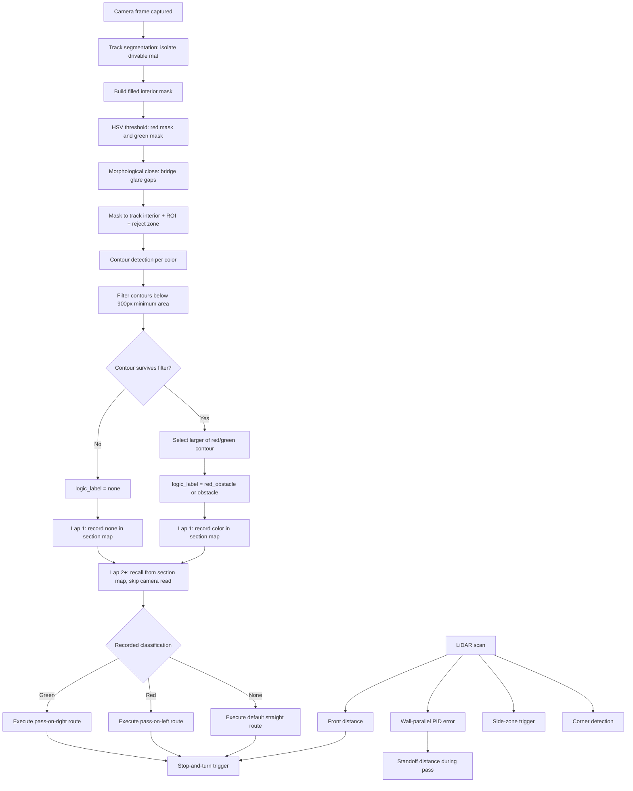
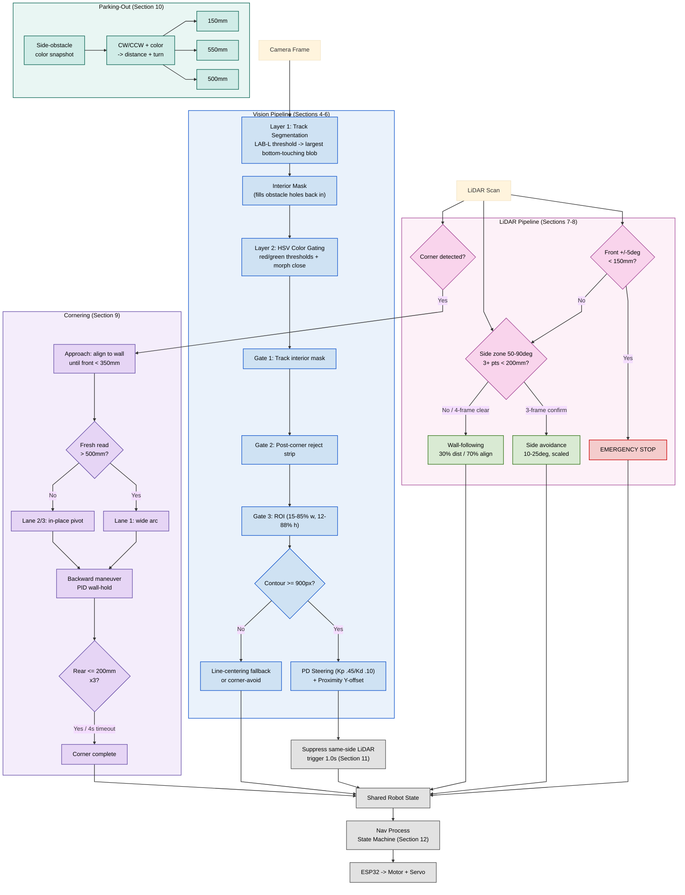
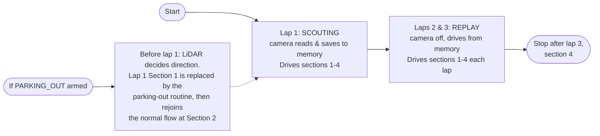

# Unsupervised-WROFE2026-India

Official repository of Team Unsupervised for the World Robot Olympiad Future Engineers 2026. This project documents the design, development, and implementation of our autonomous vehicle, integrating computer vision, embedded systems, and real-time navigation algorithms to solve the Future Engineers challenge.

## Table of Contents

- [Unsupervised-WROFE2026-India](#unsupervised-wrofe2026-india)
  - [Table of Contents](#table-of-contents)
  - [Team](#team)
  - [About the Challenge](#about-the-challenge)
  - [Performance Videos](#performance-videos)
    - [Challenge 1](#challenge-1)
    - [Challenge 2](#challenge-2)
  - [List of Components](#list-of-components)
  - [Robot Pictures](#robot-pictures)
  - [Mobility Management](#mobility-management)
    - [Controlling the Motor](#controlling-the-motor)
    - [Robot Dimensions](#robot-dimensions)
    - [Drivetrain Torque Calculation](#drivetrain-torque-calculation)
  - [Building Instructions](#building-instructions)
  - [Power and Sense Management](#power-and-sense-management)
    - [Power Distribution](#main--power-supply)
    - [Robot Dimensions](#robot-dimensions)
    - [Controlling the Motors](#controlling-the-motors)
  - [Building Instructions](#building-instructions)
  - [Power & Sense Management](#power--sense-management)
    - [Hardware Architecture](#hardware-architecture)
      - [Current Stabilisation](#current-stabilisation)
  - [Obstacle Management](#obstacle-management)
    - [Vision Methods and Decision Making](#vision-methods-and-decision-making)
    - [1) Image Pipeline (Inputs Used by Algorithms)](#1-image-pipeline-inputs-used-by-algorithms)
    - [MATLAB-Based Obstacle Detection and Colour Segmentation](#matlab-based-obstacle-detection-and-colour-segmentation)
      - [HSV-Based Colour Segmentation](#hsv-based-colour-segmentation)
      - [Generation of Colour Masks](#generation-of-colour-masks)
      - [Obstacle Selection](#obstacle-selection)
      - [Engineering Significance](#engineering-significance)
    - [2) Wall Following Calculations](#2-wall-following-calculations)
    - [3) Obstacle Handling Calculations](#3-obstacle-handling-calculations)
    - [4) Corner Detection](#4-corner-detection)
    - [5) Crash Detection](#5-crash-detection)
    - [6) Arbitration: Choosing the Action](#6-arbitration-choosing-the-action)
    - [7) Tuning Notes](#7-tuning-notes)
    - [Block Diagrams](#block-diagrams)
      - [Open Round Block Diagrams](#open-round-block-diagrams)
      - [Obstacle Round Diagrams](#obstacle-round-diagrams)
      - [Corner Logic Open Round](#corner-logic-open-round)
      - [Corner Logic Obstacle Round](#corner-logic-obstacle-round)
    - [Possible Improvements](#possible-improvements)
    - [Thank You](#thank-you)

## Team
 <br>


| Name           | Profile                                | Role        |
| -------------- | -------------------------------------- | ----------- |
| Kiara Bhandari | Grade 10 @ Oberoi International School | Team Member |
| Shubh Gupta    | Grade 10 @ Chatrabhuj Narsee School    | Team Member |
| Dhanak Seth    | Grade 8 @ Vibgyor High School          | Team Member |
| Vinay Ummadi   | Mentor @ MakerWorks Lab                | Team Mentor |

## About the Challenge

The World Robot Olympiad (WRO) is an international robotics competition that encourages students to develop problem-solving, programming, and engineering skills. The Future Engineers category is designed for students aged 14–22 years and focuses on autonomous driving. The challenge simulates real-world traffic conditions and requires teams to design and program a fully autonomous robot car.

The challenge requires students to construct an autonomous robot which will undergo 2 rounds. First, an open round challenge where the robot would need to complete 3 rounds around the arena within the time limit of 3 minutes (180 seconds). The second round, which is the obstacle round consists of navigating through red and green pillars, where the robot would move from the left of the green pillar and from right of the red pillar. The robot should once again, not exceed a time limit of 3 minutes.

## Performance Videos
### Challenge 1
[Open Challenge Video 1 - Practice before Nationals on Youtube](https://youtu.be/0ms9o5Httb8?si=1wx8qC69ZG0JPVR6)

### Challenge 2
[Obstacle Round Video 1 - Practice before Nationals on Youtube](https://youtu.be/hUuTf3fS2V0?si=C6_U4KdSrS-R3kdz) <br>
[Obstacle Round Video 2 - Practice before Nationals on Youtube](https://youtu.be/6QX_Y3WPMX4?si=ZPCf-lAfKMT5tgFE) <br>
[Obstacle Round Video 3 - Practice before APAC on Youtube](https://youtu.be/BjEGykfpRfE)


## Matlab Video
[Youtube Video: Explanation On How We Used Matlab](https://youtu.be/cSldkeClAug?si=Nf5bUmlcxWWf90j0)
[Obstacle Round Video 2 - Practice before Internationals on Youtube](https://youtu.be/6QX_Y3WPMX4?si=ZPCf-lAfKMT5tgFE)

## List of Components

| Name of Component | Quantity | Picture |
| ---- | ---- | ---- | 
| Raspberry Pi 5 (Cooling Fan + SD Card) | 1 |  |
| Raspberry Pi Camera Module 3 Wide | 1 |  |
| ESP32 Development Board | 1 |  |
| YDLidar T-Mini Plus LiDAR | 1 |  |
| PCA9685 16-Channel PWM Servo Driver | 1 |  |
| TB6612FNG Dual Motor Driver | 1 |  |
| GY-87 10-DOF Multi-Sensor IMU Module | 1 |  |
| Silicon Labs CP2102 USB-to-UART Bridge | 1 |  |
| HC-SR04 Ultrasonic Sensor | 1 |  |
| MG996 Servo Motor | 1 |  |
| 12V DC 600 RPM Encoder Motor | 1 |  |
| LiPo 3s 11.1v 2200 mAh Battery | 1 |  |
| LM2596 Step-Down (Buck) DC-DC Switching Voltage Regulator Integrated Circuit (ESP32) | 1 |  |
| XY-3606 DC-DC Step-Down Buck Converter Module (Raspberry Pi) | 1 |  |
| RC Car Rear Differential | 1 |  |
| N20 wheels | 4 |  |
| Lazy Susan Turntable Bearings | 1 |  | 

[Why we chose each component](mech/components) <br>
## Robot Pictures


360° view

<br> <br>

| Front View | Left View | Top View |
| --- | --- | --- |
|  |  |  |

| Back View | Right View | Bottom View |
| --- | --- | --- |
|  |  |  |

## Mobility Management

The robot uses a rear-wheel-drive system consisting of one 12V 600 RPM DC encoder motor connected to an RC car rear differential. The differential transfers the motors' motion to the rear wheels while allowing the wheels to rotate at different speeds during turns. Steering is provided by an MG996 servo motor connected to the front steering mechanism. The robot uses four N20 wheels, with the rear wheels being driven and the front wheels used for steering. A Lazy Susan turntable bearing supports the steering assembly.


### Robot Dimensions

- **Dimensions:** **22 cm × 11 cm × 29 cm**  
**Length × Width × Height**

**Why We Chose These Dimensions:**

We chose the dimensions of **22 cm × 11 cm × 29 cm** to provide a balance between **stability, manoeuvrability, and component placement**. The 50 cm length provides enough space to accommodate the drivetrain, battery, electronics, and sensors while maintaining a compact overall design. The 29.5 cm width provides sufficient stability during movement and turning without making the robot unnecessarily wide. The 22 cm height keeps the robot's centre of mass relatively low while providing enough clearance for mounting the camera, LiDAR, and other electronic components. These dimensions also allow the robot to remain compact enough for efficient navigation around the track.

- **Custom Mounts**: Holders for servo, differential gear, camera, and LiDAR and more. <br> [CAD Designs](mech)

- **Differential Gear**: The differential  provides smoother and more mechanically appropriate turning behaviour than directly forcing both wheels to rotate at the same speed. <br> [Why We Chose Differential Gears](mech/components)

### Controlling the Motors


The DC motor is controlled by the ESP32 through the TB6612FNG dual motor driver. The Raspberry Pi sends movement commands to the ESP32, which controls the motors according to the required speed and direction. The MG996 steering servo is controlled by the ESP32 through the PCA9685 PWM servo driver.

This code showcases our navigation manoeuvre. You can go through this to get a better understanding. [Click here for navigation code](codes/aug15_1/nav_process.py)

### Drivetrain Torque Calculation

[Click here to view the drivetrain torque calculation](docs/drivetrain-torque-calculation.md)

-------------------------------------------------------
## Building Instructions
- **Parts list** <br>
  Make sure you have all components ready before starting: 3D-printed parts, motors, drivers, electronics, screws, sensors and connectors. A complete detailed table with quantities, sources, link, prices and usage is included below for reference.<br>
[Click here to open the parts list](mech/components)

- **3D Printing Parts**<br>
  Using any 3D printer, start by 3D printing the necessary parts for the assembly. We used a Prusa Core 1. Every part needed has a STL file which you can use with any printer. If you're adventurous and want to modify a part, open the .STL file in your favorite CAD software. If you're unsure of what part you're printing, make sure to open the PNG file which contains a picture of the part.<br>
[Click here to open the .STL files](mech)

- **Custom PCB**<br>
  Fabricate the board using the Gerber files located in the project repository. Carefully solder all components onto the PCB, including power regulators, motor drivers, and pin headers. Before connecting battery power, perform a continuity test with a multimeter across the power and ground rails to ensure there are no short circuits.<br>
[Click here to open the schematics](elec/schematic.PNG)

- **Assemble the Robot**<br>
  Mechanically assembling the robot is quite straight-forward. The tricky part comes with the electrical connections. Make sure you follow correctly the following electrical drawings.<br>
_Take notes, the drawings are quite small ! Make sure to download the PDF files to be able to zoom._ <br>
[Click here to open the electrical drawings](elec/schematic.PNG)

- **Sensor Setup (LiDAR & Pi Camera)** <br>
  Secure the Pi Camera and LiDAR module onto their designated 3D-printed chassis mounts. Connect the camera to the host board's CSI port using the ribbon cable, ensuring correct pin orientation. Wire the LiDAR module to the host via USB or serial interface. Run the hardware verification scripts to verify the camera stream and confirm that 360-degree scan data is streaming cleanly into memory.<br>

## Power and Sense Management

### 1. Main Power Supply

The robot is powered from a single 11.1 V, 3S LiPo battery. A main power switch is placed immediately after the battery's positive terminal, so that every downstream circuit — both buck converters and the raw motor rail — is gated by this one switch. 

From the switched 11.1 V rail, power is distributed along two separate paths. The raw 11.1 V supply is routed directly to the VM pins of the TB6612FNG motor driver, so the motor is driven at full battery voltage without regulation. The same rail also feeds the input of the first buck converter, from which all regulated voltages in the system are ultimately derived.

This separation is intentional. Motor drive current is comparatively high and electrically noisy, due to switching transients and back-EMF, and is therefore kept on an unregulated path rather than passed through a converter that would otherwise have to absorb that noise.

### 2. Buck Converter 1: XY3036 (11.1 V to 5 V, 5 A)

The XY3036 steps the 11.1 V battery rail down to 5 V at up to 5 A. Its primary load is the Raspberry Pi 5, supplied through its USB-C input. The Pi 5 has comparatively high current demands, particularly with a camera and a USB-connected LiDAR adapter attached, and its power management IC actively monitors the current capability advertised on USB-C; an insufficient supply results in throttling. A 5 A-rated converter feeding the USB-C port directly is intended to avoid this condition.

The 5 V/5 A output of the XY3036 also serves as the input to the second buck converter, so every other regulated rail in the system is derived from this same supply, stepped down once more.

### 3. Buck Converter 2: LM2596 (5 V to 5 V, 2 A)

The LM2596 takes its input from the XY3036's 5 V output and regulates it down to 5 V at up to 2 A. Although the nominal voltage is unchanged, this stage is not redundant: its function is to provide a second, independently regulated rail so that the Raspberry Pi's supply is not shared directly with the motor driver logic or the servo driver.

The Raspberry Pi remains on the XY3036's dedicated rail. The ESP32 DEVKITC, the logic supply (VCC) of the TB6612FNG, and, indirectly, the BN0085 gyroscope and PCA9685 servo driver are instead supplied from the LM2596 rail. The motor driver's logic side switches at high frequency, and the servo draws current in bursts during motion; if these loads shared a rail directly with the Pi, the resulting ripple could couple into the Pi's supply and produce intermittent faults that are difficult to diagnose during competition. A second regulation stage isolates these load transients from the Pi's supply rail.

### 4. Rail Distribution Summary

| Rail Source | Load | |
| -------------------- | ----------------------------------------- | -------------------------------------------- |
| 11.1 V (unregulated) | Battery, via main switch | TB6612FNG motor driver (VM) |
| 5 V, 5 A | XY3036 | Raspberry Pi 5 (USB-C) |
| 5 V, 2 A | LM2596, from XY3036 output | ESP32 DEVKITC, TB6612FNG logic (VCC) |
| 3.3 V | ESP32 onboard regulator, from LM2596 rail | BN0085 gyroscope, PCA9685 servo driver logic |

The 3.3 V rail is not produced by a discrete third converter. It is generated by the ESP32 DEVKITC's own onboard regulator, which takes its input from the LM2596 rail. The supply path to the gyroscope therefore passes through four regulation stages: battery, XY3036, LM2596, and the ESP32's internal regulator.

The PCA9685 has a separate supply pin, V+, in addition to its logic VCC, used specifically for the servo output stage. Servo current draw during motion is significantly higher than the I2C logic current, and keeping this path distinct from the logic supply reduces the likelihood of that current draw appearing as noise on the I2C bus.

### 5. Power Distribution to Sensing Elements

Each sensing subsystem draws power along a distinct path, generally following the controller to which it is connected.

The N20 encoders use a four-wire connection: two signal lines (C1 and C2, for quadrature pulse counting) to ESP32 GPIO32 and GPIO33, and separate VCC and GND lines supplying the encoder's Hall-effect sensing circuitry independently of the motor's own power pins. This separation prevents switching noise on the motor supply from affecting the encoder signal lines.

The ultrasonic sensor is supplied from a 5 V rail local to the Raspberry Pi, with TRIG and ECHO connected to Pi GPIO17 and GPIO27 respectively; it operates entirely within the Pi's I/O and power domain.

The LiDAR unit is powered through its USB adapter. Its VCC, GND, SCL, and SDA lines are local to the LiDAR module, and communication with the Raspberry Pi is carried over a USB cable via a USB translator, which also supplies the module's 5 V through the same cable. Its power is therefore drawn from the Pi's own USB supply rather than from either buck converter directly.

The Pi Camera 5 is powered over the CSI ribbon cable directly from the Raspberry Pi board.

The BN0085 gyroscope operates on the 3.3 V rail described in Section 4, with SDA and SCL connected to the ESP32 for orientation data.

In general, peripherals physically and logically associated with the Raspberry Pi (camera, ultrasonic sensor, LiDAR) draw power through the Pi's own supply, while peripherals associated with the ESP32 (encoder signal circuitry, gyroscope, servo driver) draw power through the ESP32's 5 V and 3.3 V rails. Power and data paths for each subsystem are therefore kept within the same controller domain.

### 6. Common Ground

All regulators, integrated circuits, and sensors share a common ground reference. This includes the UART bridge between the Raspberry Pi and the ESP32, which explicitly specifies a shared ground line alongside its TX and RX connections (Pi Pin 8 to ESP32 RX2, Pi Pin 10 to ESP32 TX2). UART is a single-ended signaling scheme with no differential reference, so a common ground between the two devices is required for reliable communication, independent of the condition of either device's own supply rail.

### 7. Summary

The power architecture reflects three design decisions. Motor power is kept unregulated and isolated from all logic rails. The Raspberry Pi is supplied from a dedicated high-current converter that is not shared as a load by any other device. All comparatively noisy loads, including motor driver logic, the servo, and the IMU, are supplied from a second, independently regulated converter, isolating their transients from the Pi's supply.


#### Current Stabilisation

The robot uses DC-DC buck converters to regulate the voltage supplied to its electronic components. This prevents the higher battery voltage from being supplied directly to components that require lower operating voltages.

The regulated power system helps maintain stable operation of the Raspberry Pi, ESP32, sensors, and control electronics during operation.


### Hardware Architecture


The Raspberry Pi 5 acts as the main computing unit and processes data from the Raspberry Pi Camera Module 3 Wide and YDLidar T-Mini Plus LiDAR. The Raspberry Pi communicates with the ESP32 through a serial connection to send movement and steering commands. <br> [Why We Chose the Pi 5](mech/components)

The ESP32 handles real-time motor and steering control and interfaces with the robot's sensors. The GY-87 10-DOF IMU provides accelerometer and gyroscope data to estimate the robot's orientation and heading. Gyroscope yaw data is streamed from the ESP32 to the Raspberry Pi and is used by the navigation software for heading correction, cornering, and lane re-centering after obstacle avoidance. <br> [Why We Chose the ESP32](mech/components)

The YDLidar T-Mini Plus provides distance measurements around the robot for wall following and collision avoidance, while the camera provides visual information for detecting and avoiding coloured obstacles. <br> [Why We Chose the YDLiDAR](mech/components)

The PCA9685 PWM driver controls the MG996 steering servo, while the TB6612FNG motor driver controls the DC motors. 


## Obstacle Management

The robot uses a combination of computer vision, LiDAR, and IMU data to detect obstacles and determine its path through the arena.

### Vision Methods and Decision Making


The Raspberry Pi Camera Module 3 Wide is used to identify the coloured obstacles in the arena. Image processing is used to detect red and green obstacles and determine their position relative to the robot.

The YDLidar T-Mini Plus provides distance measurements around the robot. These measurements are used for wall following, obstacle detection, and determining the available space around the robot.

The GY-87 IMU provides accelerometer and gyroscope data. Gyroscope yaw data is used by the navigation software for heading correction, cornering, and lane re-centering after obstacle avoidance.

The navigation system combines information from these sensors to determine the appropriate steering angle and motor speed. The Raspberry Pi processes the sensor data and sends movement commands to the ESP32, which controls the steering servo and drive motor. 

# Obstacle Detection, Processing, and Avoidance

## 1. System Overview

Two sensors split the job:

| Sensor | Role |
|---|---|
| Camera (RGB, HSV color analysis) | Figures out the **type** of obstacle — red pillar, green pillar, or none |
| LiDAR | Measures **distance** to walls and obstacles, spots corners, and handles wall-following and stop triggers |

In short: the camera tells the robot *what* it's looking at and which side to pass on; the LiDAR tells it *how close* things are and *when* to act. The driving logic combines both to decide on one maneuver per track section.

---

## 2. Detection Stage

### 2.1 Track Isolation (Track Segmentation)

Before checking for obstacle colors, the system figures out which part of the camera frame is actually the drivable mat, so background clutter or walls never get mistaken for an obstacle.

 <br> 

- Convert the frame from BGR to **HSV color space** and threshold the **L (lightness) channel** to separate bright mat pixels from dark background/obstacle pixels.
- Run a morphological **close** (dilate → erode) to bridge small gaps caused by colored tape lines, so tape doesn't split the mat into separate regions.
- Use `cv2.connectedComponentsWithStats` to find all bright regions, then keep only the one **touching the bottom row** of the frame — that's the track the robot is currently on. Discard everything else.
- This gives a binary **track mask** (255 = track, 0 = everything else). An obstacle sitting on the mat blocks the brightness underneath it, so it shows up as a dark "hole" inside the track region.
- Fill that hole in to get a **filled interior mask** — "everything inside the track boundary, obstacle or not." This is needed because the raw track mask would blank out the very obstacle the pipeline is trying to find; the filled version is what color detection actually gets restricted to.

### 2.2 Color-Based Pillar Detection

With the interior mask ready, the system looks for red and green pillars using HSV thresholding:

 <br>


- Convert BGR to **HSV**, since HSV separates color (hue) from lighting (saturation/value) much better than BGR.
- **Green mask:** one hue range (default 35–85) plus minimum saturation/value floors.
- **Red mask:** red wraps around the hue wheel at 0°/180°, so two hue ranges (default 0°–7° and 173°–180°) are combined with `cv2.bitwise_or`.
- Saturation/value floors are **tunable live** at runtime (thread-safe parameter store) to handle lighting changes at the venue without re-flashing code. Hue bounds stay mostly fixed since hue doesn't shift much with lighting — only their edges (where red/green fade into orange/yellow) are adjustable.
- Apply a **morphological close** (7×7 elliptical kernel) to each color mask first, to reconnect a single obstacle that glare or reflections split into separate blobs.
- **AND** both masks with the track interior mask from Section 2.1. This removes any pillar-colored object outside the track boundary at the pixel level, so it's never even offered to the contour detector.
- If a post-corner rejection zone is active (a short window after a corner maneuver where leftover motion or a partial-turn frame could cause false detections), also mask out a vertical strip on the relevant side.
- Detection is limited to a **Region of Interest (ROI)**: roughly the central 70% of frame width (15%–85%) and middle 76% of height (12%–88%). This avoids lens distortion and clutter at the extreme edges, while still leaving room for distant, small, high-in-frame obstacles to register at their true size.
- Run `cv2.findContours` separately on the red and green masks. Drop any contour under **900 px²** to filter out tape specks, reflections, or noise.
- If both colors have a surviving contour, pick the **larger** one, assuming the bigger blob is the nearer, currently-relevant obstacle.
- Output: a `logic_label` of `red_obstacle`, `obstacle` (green), or `none`.
- As a diagnostic aid: even if nothing clears the area filter, the largest unfiltered contour (either color) is still tracked and reported with its real area — this helps tell "obstacle present but too small/clipped" apart from "color threshold isn't catching it at all."

---

## 3. Processing Stage

There are two separate processing modes for two different purposes.

### 3.1 Continuous PD Steering Correction

Used for real-time, frame-by-frame pillar avoidance and for the standalone diagnostic tool:

 <br>


- **Target point:** each color aims for an x-coordinate at the ROI edge opposite the side it must pass on (green → right edge, red → left edge), so the correction steers toward the correct passing side, not just toward the obstacle.
- **Error:** horizontal pixel distance between the obstacle's detection point (bottom-center of its bounding box) and its target x-coordinate.
- **PD control law:**
  ```
  steering_angle = Kp * error + Kd * (error - previous_error)
  ```
  with `Kp = 0.45`, `Kd = 0.1`. The derivative term smooths out single noisy frames. `previous_error` is stored per color across frames so the derivative term has something to compare against.
- **Y-offset correction:** an extra term, `Y_OFFSET_GAIN * (obstacle_bottom_y - ROI_top_y)`, adds more steering push the closer the obstacle's bottom point is to the robot, applied in the direction of the x-error's sign. So correction strengthens as the robot approaches, instead of staying constant.
- **Fallback when nothing is detected:** switch to line-centering — compare black pixel area on the left vs. right half of the ROI (the track lines) and steer to balance them. If the frame is very dark overall (mean grayscale under 50), treat it as a wall/corner ahead and apply a fixed sharp turn instead.
- When no pillar is tracked in a frame, reset both colors' `previous_error` to zero, so a stale derivative doesn't cause a steering spike if a pillar reappears later.

### 3.2 Single-Shot Classification with Lap Memory

The competition run doesn't steer continuously around pillars — instead it takes **one classification read per checkpoint** via `read_obstacle()`:

 <br>

- **Lap 1:** every section is actively scouted — capture a frame, run it through the Section 2 pipeline, and store the result (`red` / `green` / `none`) in a section map keyed by `(direction, section, level)`. A section can hold up to three obstacle positions (L1/L2/L3), but only specific combos are valid (a single obstacle, or L1+L3 — never L1+L2 or L2+L3).
- **Later laps:** skip the camera for any section already scouted, and just recall the stored classification. This avoids risking a bad live read (motion blur, blocked view, lighting drift) for something that's already known and constant.
- If a scouting read got cut short (e.g. a safety timeout), `read_obstacle()` falls back to a live capture instead of trusting an incomplete record.

---

## 4. Avoidance Stage

Once a `logic_label` (live or recalled) is available, the robot runs a fixed, pre-defined maneuver rather than steering freely:

- **Green obstacle →** pass on the **right** (pillar stays on the robot's left).
- **Red obstacle →** pass on the **left** (pillar stays on the robot's right).
- **No obstacle →** take the default straight-through route.

Each maneuver typically pairs with LiDAR-driven **wall-following-and-stop** (Section 5): the robot advances under wall-follow PID until the LiDAR's front distance crosses a stop threshold (350 mm for both green and "none" at checkpoint L3), then the next scripted turn fires.

---

## 5. LiDAR's Role in Avoidance

While the camera identifies the obstacle, the LiDAR continuously provides the distance/geometry needed to execute the maneuver safely:

 <br>


- **Front distance:** average of valid LiDAR points within ±10° of straight ahead — the main trigger for "stop advancing, execute next turn."
- **Wall-parallel error:** PID input measuring how parallel the robot is to the wall it's following (left wall clockwise, right wall counter-clockwise, chosen dynamically from live shared state). Keeps a steady 500 mm standoff while passing a pillar.
- **Side-zone triggers:** points in the 50°–90° zone on each side are checked against a 200 mm threshold. 3+ such points trip a raw "obstruction on this side" flag — an independent safety signal separate from the wall-follow PID, for reacting faster than the PID alone might.
- **Corner detection:** a split-and-merge algorithm looks for an L-shaped discontinuity in the LiDAR data, signaling a real track corner (not a pillar). This is handled by a separate cornering routine.

---

## 6. End-to-End Flow



### MATLAB-Based Obstacle Detection and Colour Segmentation


[Youtube Video: Explanation On How We Used Matlab](https://youtu.be/cSldkeClAug?si=Nf5bUmlcxWWf90j0)
<br>

A key challenge in autonomous navigation is converting the visual information captured by the camera into information that the robot can use to make decisions. The raw camera image contains the complete environment, including the track, obstacles, boundaries and surrounding background. Processing this entire image directly would introduce unnecessary visual information and make reliable obstacle identification more difficult.

To address this, we developed a colour-based image-segmentation approach using MATLAB. MATLAB was used to analyse camera images and investigate how the coloured obstacles could be isolated from the surrounding environment. The segmentation process converts the original image into a simplified representation in which pixels corresponding to relevant obstacle colours are identified and separated from the background.


Our implementation uses the HSV colour space rather than directly thresholding the RGB image. HSV separates colour information into Hue, Saturation and Value components, allowing the colour characteristics of the obstacles to be analysed independently from the overall image representation.

The developed system specifically analyses the colour characteristics associated with the obstacles and generates separate segmentation masks for the detected colours. These masks are then filtered to remove insignificant regions before the remaining regions are used for obstacle identification.

The overall process can be represented as:

**Camera Image → RGB-to-HSV Conversion → Colour Thresholding → Binary Masks → Region Filtering → Obstacle Identification → Navigation Decision**

This process significantly reduces the complexity of the visual input available to the navigation system. Instead of processing every element of the camera image equally, the algorithm extracts the visual information that is directly relevant to obstacle detection.

MATLAB-based obstacle segmentation pipeline. The original camera image is converted into colour-specific segmentation masks. The red and green masks isolate pixels belonging to the corresponding obstacle colours, while the segmented overlay visualises the regions identified by the algorithm. The selected obstacle is subsequently highlighted for use in the navigation process.

**MATLAB obstacle-perception pipeline: raw image → colour segmentation → filtered candidate regions → obstacle identification** 


#### HSV-Based Colour Segmentation

The RGB camera image is converted into HSV representation before segmentation. This allows the algorithm to define thresholds using Hue, Saturation and Value rather than relying directly on the three RGB intensity channels.

For each target obstacle colour, a range of acceptable HSV values is defined. A pixel is classified as belonging to the target colour only when its HSV components fall within the specified ranges.

This can be represented conceptually as:

$$
H_{\min} \leq H(x,y) \leq H_{\max}
$$

$$
S_{\min} \leq S(x,y) \leq S_{\max}
$$

$$
V_{\min} \leq V(x,y) \leq V_{\max}
$$

Pixels satisfying these conditions are assigned to the corresponding binary mask.

An important implementation detail was the treatment of red. Because red lies around the boundary of the Hue scale, it cannot always be represented effectively using one continuous Hue interval. Therefore, the implementation uses two red Hue ranges, which are subsequently combined into a single red mask.

This prevents valid red pixels from being incorrectly excluded simply because they occur on opposite sides of the Hue representation boundary.

#### Generation of Colour Masks
Separate binary masks are generated for the detected obstacle colours. In the resulting masks, pixels satisfying the selected colour criteria are represented as foreground pixels, while pixels that do not satisfy the criteria are rejected.

The resulting masks provide a substantially simpler representation of the environment than the original camera image. For example, the red mask contains only the regions identified as red, while the green mask contains only the regions identified as green.

This separation allows subsequent processing to operate on specific candidate obstacle regions rather than the complete camera frame.

The segmentation output therefore acts as an interface between raw visual perception and geometric obstacle detection.


#### Obstacle Selection

Following segmentation and filtering, the detected regions can be evaluated as obstacle candidates. The visual overlay provides a direct representation of which region has been identified by the algorithm as the relevant obstacle.

In the demonstrated test image, the algorithm successfully isolates the coloured obstacle from the surrounding environment and identifies the corresponding region as the obstacle candidate.

This is an important transition in the perception pipeline: the algorithm moves from pixel-level classification to object-level interpretation.

In other words:

Pixel classification → Connected region → Obstacle candidate → Navigation information

This extracted information can then be provided to the navigation system to influence the robot's movement and obstacle-avoidance behaviour.


#### Engineering Significance

The MATLAB segmentation process allowed us to reduce a high-dimensional camera image into a smaller set of meaningful visual features. Instead of treating the entire image as equally important, the algorithm selectively extracts regions corresponding to potential obstacles.

This creates a structured perception pipeline in which colour information is converted into spatial information, and spatial information can subsequently be converted into navigation decisions.

The significance of the approach is therefore not simply that an obstacle can be visually highlighted. The segmentation provides the foundation for enabling the robot to interpret its environment computationally and make autonomous decisions based on the detected obstacles.

MATLAB was used for image-processing development, analysis and validation, while the resulting vision approach was integrated into the robot's deployed software architecture.

### 2) Wall Following Calculations

LiDAR measurements are used to determine the robot's distance from the walls.

The navigation algorithm compares the measured distance with the desired wall distance and calculates a steering correction. This allows the robot to maintain a suitable position within the lane while moving around the arena.

- Multi-Ray Sampling: Pulls depth readings from key positions in the scan array: straight left ($-90^\circ$), straight right ($+90^\circ$), and front diagonals ($\pm 45^\circ$).  
- Heading & Alignment: Calculates lateral offset by subtracting right distance from left distance, while diagonal rays determine the robot's tilt angle relative to parallel track walls.
- PD Control Loop: Feeds distance error ($P$) and rate of drift ($D$) into a Proportional-Derivative steering controller to keep the robot smoothly centered in the lane. <br>

Look at [Lidar_Process.py](codes/aug15_1/lidar_process.py) for more understanding

### 3) Obstacle Handling Calculations


The robot uses the Raspberry Pi Camera Module 3 Wide to detect the track and coloured obstacles. The image-processing pipeline consists of several stages:

1. **Image acquisition:** The camera captures the complete view in front of the robot.

2. **Track masking:** A mask is applied to identify the drivable track region. Geometric conditions are used to filter the detected region, including requirements for the region to reach the bottom of the image. This helps identify the area of the track that is relevant to the robot's current position.

3. **Obstacle detection:** Potential obstacles are detected within the camera image using geometric and colour-based conditions. Conditions such as the obstacle's height, width, position, and relationship with the track are used to filter detections and produce an obstacle mask.

4. **Obstacle localisation:** Once an obstacle is detected, its size and image coordinates are extracted. These measurements are used to estimate its position and distance relative to the robot.

5. **Steering calculation:** The detected obstacle position is used to determine the required steering response. PID controllers are used to adjust the steering based on the calculated error.

6. **Parameter tuning:** HSV and LAB colour thresholds and PID parameters are tuned experimentally through repeated testing. The Flask-based tuning interface allows vision parameters to be adjusted during testing without repeatedly changing the main source code.

### 4) Corner Detection
- Pattern Recognition: Detects turn entry when diagonal depth rays suddenly spike outward (wall disappears) while front distance readings shrink.
- Snapshot Retrieval: Uses SharedScanReader to capture a frozen snapshot of the 361-slot distance array.
- Arc Execution: Suspends standard wall-following and hands steering authority to execute_cornering(), which runs a pre-calculated turning arc until side walls reappear.  

### 5) Crash Detection

The LiDAR is used to detect imminent collisions by monitoring the distance in the forward region of the robot. When an obstacle is detected within the defined safety threshold, collision avoidance is given priority over normal navigation.

The navigation system determines an escape direction based on the available space and temporarily overrides the normal steering behaviour to avoid the collision.

- Proximity Guard: Scans a $30^\circ$ forward wedge (indices $-15^\circ$ to $+15^\circ$) in the scan buffer, triggering an emergency stop if any value drops below $0.12\text{m}$.
- Stall Guard: Monitors wheel encoder tick rates against motor throttle commands. Flags a crash if throttle is active but wheel rotation halts for over 200ms.
- Emergency Intervention: Instantly overrides all routines to cut forward throttle, trigger reverse power, and steer away from the obstacle.

### 6) Arbitration: Choosing the Action


The navigation system uses a priority-based arbitration system to determine which behaviour should control the robot at any given moment. Higher-priority behaviours override lower-priority behaviours when multiple conditions are detected simultaneously.

The behaviour hierarchy is:

**Imminent collision avoidance**: Highest priority. If a collision is detected as imminent by the LiDAR, the robot immediately performs an escape manoeuvre.

**Corner turning**: A committed corner-turning manoeuvre takes priority over normal obstacle avoidance and wall following. It is interrupted only by an imminent collision.

**Side obstacle avoidance**: LiDAR side-proximity warnings override camera-based pillar avoidance when the robot is too close to a side wall.

**Camera obstacle avoidance**: Red and green obstacles detected using computer vision generate a steering response.

**LiDAR wall following**: When no higher-priority behaviour is active, the robot follows the wall using LiDAR measurements and PID control.

**Fallback**: If none of the above behaviours can provide a valid navigation command, the robot continues straight at the cruise speed.

This hierarchy prevents conflicting behaviours from simultaneously controlling the steering system and ensures that immediate safety conditions take precedence over normal navigation.

### 7) Tuning Notes

The steering and navigation parameters are tuned through repeated testing on the arena. Parameters such as steering corrections, motor speed, wall-following distance, and obstacle detection thresholds are adjusted to improve stability and reduce unnecessary corrections. Colour parameters for obstacles can be tuned using an HSV adjuster on a Flask interface while the robot is running.

### Block Diagrams
#### Open Round Block Diagrams


#### Obstacle Round Diagrams



#### Corner Logic Open Round


#### Round Counting Obstacle Round




**How the round counting works**

The robot's course is divided into 4 fixed "sections" (roughly corner-to-corner segments), and a full run is 3 laps around that same course — so 12 sections total, tracked with two simple counters: `current_lap` (1–3) and `current_section` (1–4).

- **Lap 1 is the "scouting" lap.** The camera is on, and as the robot drives each section it identifies obstacles and writes what it saw into memory (keyed by lap/section).
- **Laps 2 and 3 are "replay" laps.** The camera turns off, and the robot just drives off what it already memorized in lap 1 — same course, so no need to re-observe it.
- **The section counter drives the inner loop**, cycling 1→2→3→4 within each lap before the lap counter increments.
- **The run doesn't stop because a counter rolls over** — it stops because of one explicit check: "is this lap 3 *and* section 4?" (i.e., the very last section of the very last lap). When that's true, the robot just stops in place instead of continuing on to a section 5 that doesn't exist. Every other section transition automatically sets up and moves into the next one.

-------------------------------------------------------
### Possible Improvements
**1. Structural Reinforcement & Vibration Isolation**

- Material Upgrade: Switch high-stress 3D-printed parts from standard PLA to PETG, ABS, or Carbon-Fiber PETG to stop chassis flex during sharp, high-speed maneuvers.

- Vibration Dampening: Add TPU shock mounts or rubber grommets under the camera and LiDAR mounts. High-frequency motor vibrations introduce sensor noise into LiDAR distance scans and cause micro-blur in camera frames.

**2. Hardware Acceleration for the Vision Pipeline**

- Offloaded Processing: Move HSV color thresholding and contour tracking from the host CPU to a dedicated hardware accelerator (such as OpenCV GPU acceleration or a light Edge AI accelerator).

- Latency Reduction: Cuts camera processing latency from ~30ms down to under 5ms. This allows the obstacle detection algorithm to feed target updates into shared memory significantly faster, enabling higher safe cruising speeds.
-------------------------------------------------------
### Thank You

On behalf of Team Unsupervised, we want to extend our deepest gratitude to everyone who made this journey possible. A massive thank you to our incredible mentors — Vinay Sir, Vamsi Sir, and Abhay Sir — for your endless patience, technical guidance and for constantly pushing us to solve problems even when our code or hardware refused to cooperate. We are immensely grateful to the whole team at Makerworks Lab for giving us the space, tools, and encouraging environment to experiment, iterate, and bring our ideas to life. Finally, a special thank you to our parents, whose constant encouragement, belief in us, and behind-the-scenes support kept us going through every long hour. We truly couldn't have built any of this without your guidance, trust, and support!


