# Unsupervised-WROFE2026-India

Official repository of Team Unsupervised for the World Robot Olympiad Future Engineers 2026. This project documents the design, development, and implementation of our autonomous vehicle, integrating computer vision, embedded systems, and real-time navigation algorithms to solve the Future Engineers challenge.

## Table of Contents

- [Unsupervised-WROFE2026-India](#unsupervised-wrofe2026-india)
  - [Table of Contents](#table-of-contents)
  - [Team](#team)
  - [About the challenge](#about-the-challenge)
  - [Performance Videos](#performance-videos)
  - [List of Components](#list-of-components)
  - [Robot Pictures](#robot-pictures)
  - [Mobility Management](#mobility-management)
    - [Controlling the Motors](#controlling-the-motors)
    - [Robot Dimensions](#robot-dimensions)
  - [Building Instructions](#building-instructions)
  - [Power & Sense Management](#power--sense-management)
    - [Hardware Architecture](#hardware-architecture)
    - [Security Measures](#security-measures)
      - [Current Stabilisation](#current-stabilisation)
  - [Obstacle Management](#obstacle-management)
    - [Vision Methods and Decision Making](#vision-methods-and-decision-making)
    - [1) Image pipeline (inputs used by algorithms)](#1-image-pipeline-inputs-used-by-algorithms)
    - [2) Wall following calculations](#2-wall-following-calculations)
    - [3) Obstacle handling calculations](#3-obstacle-handling-calculations)
    - [4) Crash detection](#4-crash-detection)
    - [5) Arbitration: choosing the action](#5-arbitration-choosing-the-action)
    - [6) Tuning notes](#6-tuning-notes)
    - [Block diagrams](#block-diagrams)
    - [Extras](#extras)
  - [Software Key Components](#software-key-components)
  - [Possible Improvements](#possible-improvements)

## Team

| Name           | Profile                                | Role        |
| -------------- | -------------------------------------- | ----------- |
| Kiara Bhandari | Grade 10 @ Oberoi International School | Team Member |
| Shubh Gupta    | Grade 10 @ Chatrabhuj Narsee School    | Team Member |
| Dhanak Seth    | Grade 8 @ Vibgyor High School          | Team Member |
| Vinay Ummadi   | Mentor @ MakerWorks Lab                | Team Mentor |

## About the Challenge

The World Robot Olympiad (WRO) is an international robotics competition that encourages students to develop problem-solving, programming, and engineering skills. The Future Engineers category is designed for students aged 14–22 years and focuses on autonomous driving. The challenge simulates real-world traffic conditions and requires teams to design and program a fully autonomous robot car.

The challenge requires students to construct an autonomous robot which will undergo 2 rounds. First, an open round challenge where the robot would need to complete 3 rounds around the arena within the time limit of 3 minutes (180 seconds). The second round, which is the obstacle round consists of navigating through red and green pillars, where the robot would move from the left of the green pillar and from right of the red pillar. The robot should once again, not exceed a time limit of 3 minutes.

## Performance Videos
### Challenge 1
[Open Challenge Video 1 - Practice before Nationals on Youtube](https://youtu.be/0ms9o5Httb8?si=1wx8qC69ZG0JPVR6)

### Challenge 2
[Obstacle Round Video 1 - Practice before Nationals on Youtube](https://youtu.be/hUuTf3fS2V0?si=C6_U4KdSrS-R3kdz)  
[Obstacle Round Video 2 - Practice before Nationals on Youtube](https://youtu.be/6QX_Y3WPMX4?si=ZPCf-lAfKMT5tgFE)

## List of Components

| Name of Component | Quantity | Picture |
| ---- | ---- | ---- | 
| Raspberry Pi 5 (Cooling Fan + SD Card) | 1 |  |
| Raspberry Pi Camera Module 3 Wide | 1 |  |
| ESP32 Development Board | 1 |  |
| YDLidar T-Mini Plus LiDAR | 1 |  |
| PCA9685 16-Channel PWM Servo Driver | 1 |  |
| TB6612FNG Dual Motor Driver | 1 |  |
| GY-87 10-DOF Multi-Sensor IMU Module | 1 |  |
| Silicon Labs CP2102 USB-to-UART Bridge | 1 |  |
| HC-SR04 Ultrasonic Sensor | 1 |  |
| MG996 Servo Motor | 1 |  |
| N20 200 rpm Gear Motors | 2 |  |
| LiPo 3s 11.1v 2200 mAh Battery | 1 |  |
| LM2596 Step-Down (Buck) DC-DC Switching Voltage Regulator Integrated Circuit (ESP32) | 1 |  |
| XY-3606 DC-DC Step-Down Buck Converter Module (Raspberry Pi) | 1 |  |
| RC Car Rear Differential | 1 |  |
| N20 wheels | 4 |  |
| Lazy Susan Turntable Bearings | 1 |  | 

## Robot Pictures

360° view

   

| Front View | Left View | Top View |
| --- | --- | --- |
| 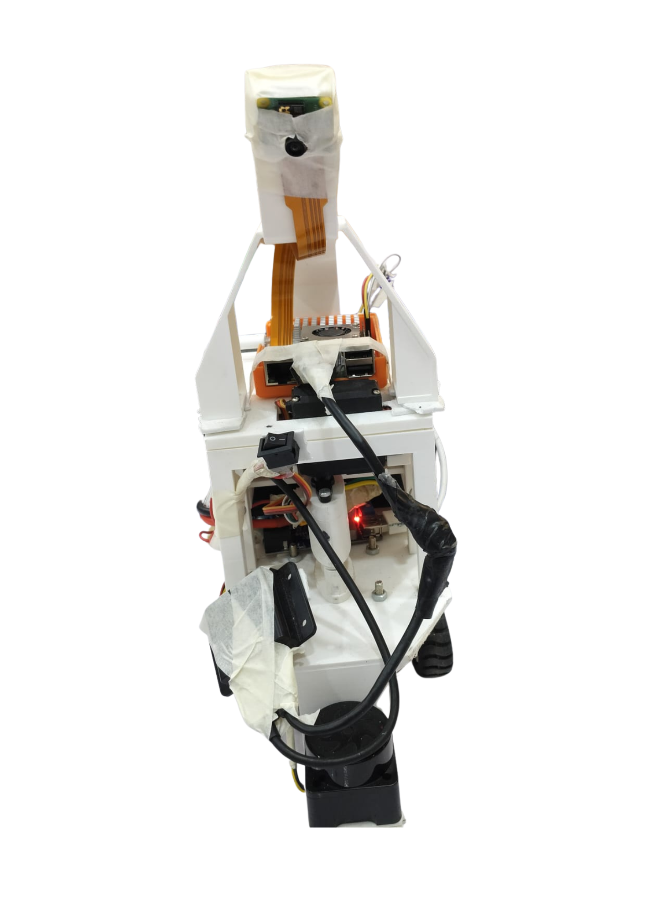 | 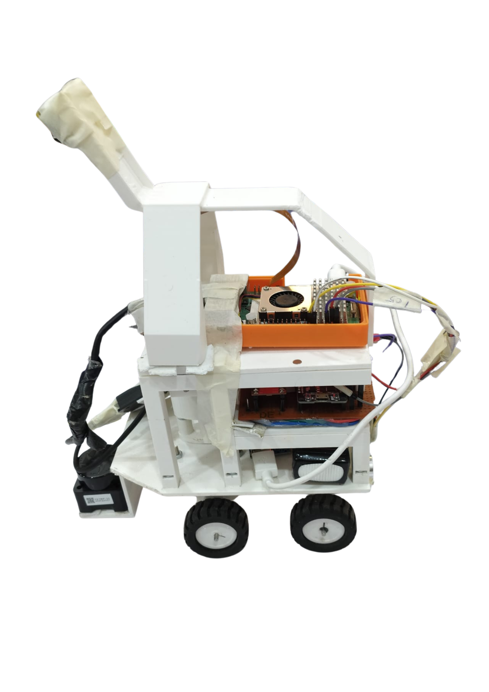 | 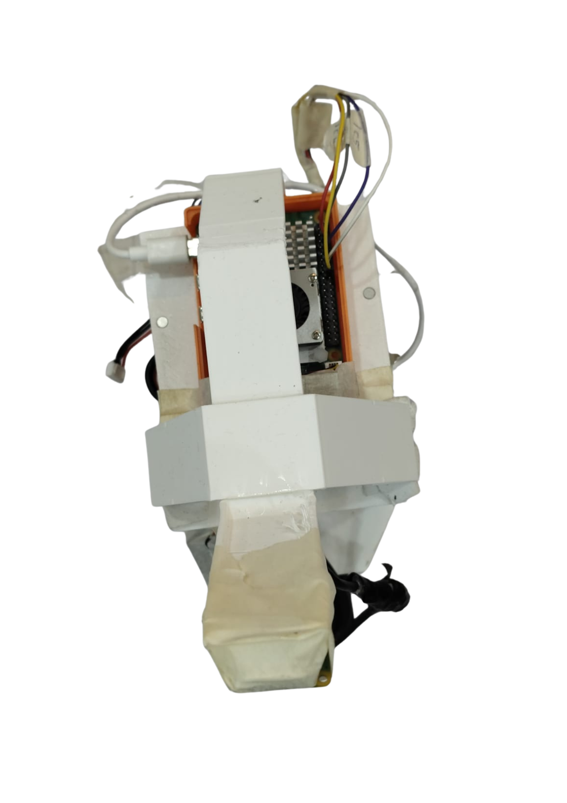 |

| Back View | Right View | Bottom View |
| --- | --- | --- |
| 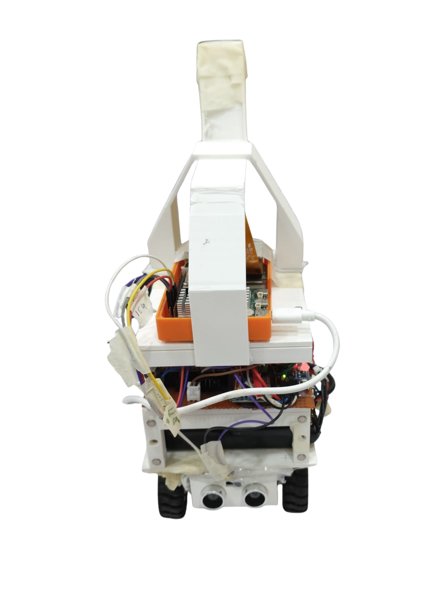 | 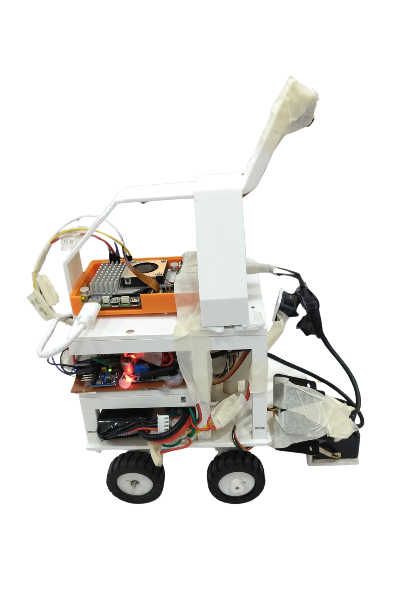 | 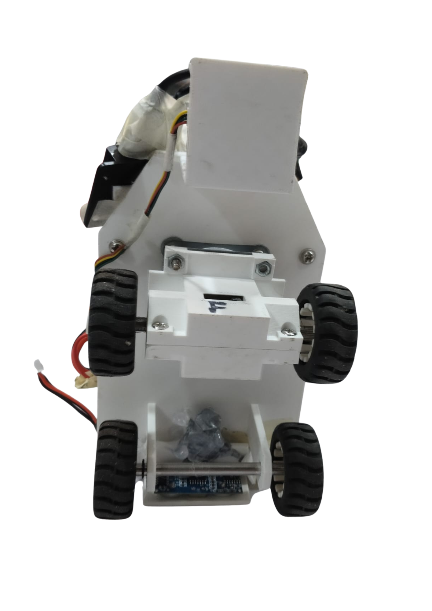 |

## Mobility Management

The robot uses a rear-wheel-drive system consisting of two N20 200 RPM gear motors connected to an RC car rear differential. The differential transfers the motors' motion to the rear wheels while allowing the wheels to rotate at different speeds during turns. Steering is provided by an MG996 servo motor connected to the front steering mechanism. The robot uses four N20 wheels, with the rear wheels being driven and the front wheels used for steering. A Lazy Susan turntable bearing supports the steering assembly.

### Robot Dimensions

**Dimensions:** **50 cm × 29.5 cm × 22 cm**  
**Length × Width × Height**

**Why We Chose These Dimensions:**

We chose the dimensions of **50 cm × 29.5 cm × 22 cm** to provide a balance between **stability, manoeuvrability, and component placement**. The 50 cm length provides enough space to accommodate the drivetrain, battery, electronics, and sensors while maintaining a compact overall design. The 29.5 cm width provides sufficient stability during movement and turning without making the robot unnecessarily wide. The 22 cm height keeps the robot's centre of mass relatively low while providing enough clearance for mounting the camera, LiDAR, and other electronic components. These dimensions also allow the robot to remain compact enough for efficient navigation around the track.

### Controlling the Motors

The two N20 gear motors are controlled by the ESP32 through the TB6612FNG dual motor driver. The Raspberry Pi sends movement commands to the ESP32, which controls the motors according to the required speed and direction. The MG996 steering servo is controlled by the ESP32 through the PCA9685 PWM servo driver.

-------------------------------------------------------
## Building Instructions
- **Parts list**  
  Make sure you have all components ready before starting: 3D-printed parts, motors, drivers, electronics, screws, sensors and connectors. A complete detailed table with quantities, sources, link, prices and usage is included below for reference. 
[Click here to open the parts list](mech/components)

- **3D Printing Parts** 
  Using any 3D printer, start by 3D printing the necessary parts for the assembly. We used a Prusa Core 1. Every part needed has a STL file which you can use with any printer. If you're adventurous and want to modify a part, open the .STL file in your favorite CAD software. If you're unsure of what part you're printing, make sure to open the PNG file which contains a picture of the part. 
[Click here to open the .STL files](mech)

- **Custom PCB** 
  Fabricate the board using the Gerber files located in the project repository. Carefully solder all components onto the PCB, including power regulators, motor drivers, and pin headers. Before connecting battery power, perform a continuity test with a multimeter across the power and ground rails to ensure there are no short circuits. 
[Click here to open the schematics](mech)

- **Assemble the Robot** 
  Mechanically assembling the robot is quite straight-forward. The tricky part comes with the electrical connections. Make sure you follow correctly the following electrical drawings. 
_Take notes, the drawings are quite small ! Make sure to download the PDF files to be able to zoom._  
[Click here to open the electrical drawings](mech)

- **Sensor Setup (LiDAR & Pi Camera)**  
  Secure the Pi Camera and LiDAR module onto their designated 3D-printed chassis mounts. Connect the camera to the host board's CSI port using the ribbon cable, ensuring correct pin orientation. Wire the LiDAR module to the host via USB or serial interface. Run the hardware verification scripts to verify the camera stream and confirm that 360-degree scan data is streaming cleanly into memory. 

## Power & Sense Management

The robot is powered by a LiPo 3S 11.1 V 2200 mAh battery. DC-DC buck converters regulate the battery voltage to suitable levels for the Raspberry Pi 5 and ESP32. The regulated power supplies allow the computing, sensing, and control components to operate reliably.

### Hardware Architecture

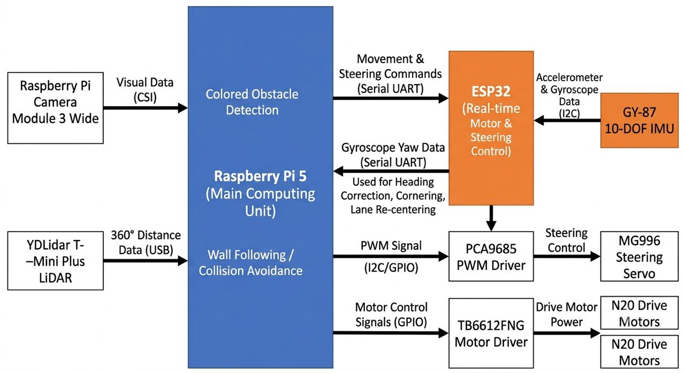

The Raspberry Pi 5 acts as the main computing unit and processes data from the Raspberry Pi Camera Module 3 Wide and YDLidar T-Mini Plus LiDAR. The Raspberry Pi communicates with the ESP32 through a serial connection to send movement and steering commands.

The ESP32 handles real-time motor and steering control and interfaces with the robot's sensors. The GY-87 10-DOF IMU provides accelerometer and gyroscope data to estimate the robot's orientation and heading. Gyroscope yaw data is streamed from the ESP32 to the Raspberry Pi and is used by the navigation software for heading correction, cornering, and lane re-centering after obstacle avoidance.

The YDLidar T-Mini Plus provides distance measurements around the robot for wall following and collision avoidance, while the camera provides visual information for detecting and avoiding coloured obstacles.

The PCA9685 PWM driver controls the MG996 steering servo, while the TB6612FNG motor driver controls the N20 drive motors.

### Security Measures

#### Current Stabilisation

The robot uses DC-DC buck converters to regulate the voltage supplied to its electronic components. This prevents the higher battery voltage from being supplied directly to components that require lower operating voltages.

The regulated power system helps maintain stable operation of the Raspberry Pi, ESP32, sensors, and control electronics during operation.

## Obstacle Management

The robot uses a combination of computer vision, LiDAR, and IMU data to detect obstacles and determine its path through the arena.

### Vision Methods and Decision Making

The Raspberry Pi Camera Module 3 Wide is used to identify the coloured obstacles in the arena. Image processing is used to detect red and green obstacles and determine their position relative to the robot.

The YDLidar T-Mini Plus provides distance measurements around the robot. These measurements are used for wall following, obstacle detection, and determining the available space around the robot.

The GY-87 IMU provides accelerometer and gyroscope data. Gyroscope yaw data is used by the navigation software for heading correction, cornering, and lane re-centering after obstacle avoidance.

The navigation system combines information from these sensors to determine the appropriate steering angle and motor speed. The Raspberry Pi processes the sensor data and sends movement commands to the ESP32, which controls the steering servo and drive motors.

### 1) Image Pipeline (Inputs Used by Algorithms)

**Obstacle Detection Algorithm**

The camera captures images of the arena, which are processed on the Raspberry Pi.

The image-processing pipeline consists of:
1. Capturing an image from the camera.
2. Converting the image into a HSV colour space.
3. Segmenting the track.
4. Detecting the relevant coloured regions.
5. Identifying red and green obstacles.
6. Determining the position of detected obstacles.
7. Passing the resulting information to the navigation algorithm.

### 2) Wall Following Calculations

LiDAR measurements are used to determine the robot's distance from the walls.

The navigation algorithm compares the measured distance with the desired wall distance and calculates a steering correction. This allows the robot to maintain a suitable position within the lane while moving around the arena.

- Multi-Ray Sampling: Pulls depth readings from key positions in the scan array: straight left ($-90^\circ$), straight right ($+90^\circ$), and front diagonals ($\pm 45^\circ$).  
- Heading & Alignment: Calculates lateral offset by subtracting right distance from left distance, while diagonal rays determine the robot's tilt angle relative to parallel track walls.
- PD Control Loop: Feeds distance error ($P$) and rate of drift ($D$) into a Proportional-Derivative steering controller to keep the robot smoothly centered in the lane.

### 3) Obstacle Handling Calculations

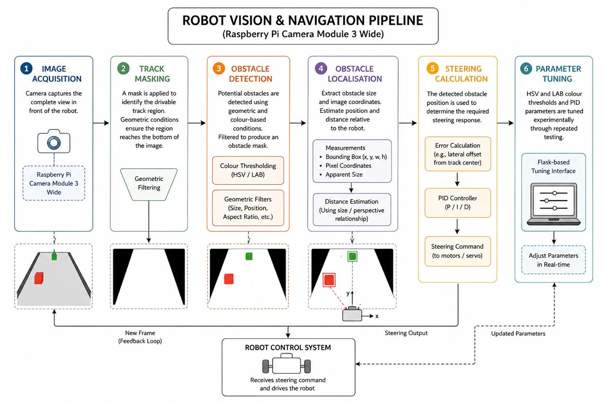

The robot uses the Raspberry Pi Camera Module 3 Wide to detect the track and coloured obstacles. The image-processing pipeline consists of several stages:

1. **Image acquisition:** The camera captures the complete view in front of the robot.

2. **Track masking:** A mask is applied to identify the drivable track region. Geometric conditions are used to filter the detected region, including requirements for the region to reach the bottom of the image. This helps identify the area of the track that is relevant to the robot's current position.

3. **Obstacle detection:** Potential obstacles are detected within the camera image using geometric and colour-based conditions. Conditions such as the obstacle's height, width, position, and relationship with the track are used to filter detections and produce an obstacle mask.

4. **Obstacle localisation:** Once an obstacle is detected, its size and image coordinates are extracted. These measurements are used to estimate its position and distance relative to the robot.

5. **Steering calculation:** The detected obstacle position is used to determine the required steering response. PID controllers are used to adjust the steering based on the calculated error.

6. **Parameter tuning:** HSV and LAB colour thresholds and PID parameters are tuned experimentally through repeated testing. The Flask-based tuning interface allows vision parameters to be adjusted during testing without repeatedly changing the main source code.

### 4) Corner Detection
- Pattern Recognition: Detects turn entry when diagonal depth rays suddenly spike outward (wall disappears) while front distance readings shrink.
- Snapshot Retrieval: Uses SharedScanReader to capture a frozen snapshot of the 361-slot distance array.
- Arc Execution: Suspends standard wall-following and hands steering authority to execute_cornering(), which runs a pre-calculated turning arc until side walls reappear.  

### 5) Crash Detection

The LiDAR is used to detect imminent collisions by monitoring the distance in the forward region of the robot. When an obstacle is detected within the defined safety threshold, collision avoidance is given priority over normal navigation.

The navigation system determines an escape direction based on the available space and temporarily overrides the normal steering behaviour to avoid the collision.

- Proximity Guard: Scans a $30^\circ$ forward wedge (indices $-15^\circ$ to $+15^\circ$) in the scan buffer, triggering an emergency stop if any value drops below $0.12\text{m}$.
- Stall Guard: Monitors wheel encoder tick rates against motor throttle commands. Flags a crash if throttle is active but wheel rotation halts for over 200ms.
- Emergency Intervention: Instantly overrides all routines to cut forward throttle, trigger reverse power, and steer away from the obstacle.

### 6) Arbitration: Choosing the Action

The navigation system uses a priority-based arbitration system to determine which behaviour should control the robot at any given moment. Higher-priority behaviours override lower-priority behaviours when multiple conditions are detected simultaneously.

The behaviour hierarchy is:

**Imminent collision avoidance**: Highest priority. If a collision is detected as imminent by the LiDAR, the robot immediately performs an escape manoeuvre.

**Corner turning**: A committed corner-turning manoeuvre takes priority over normal obstacle avoidance and wall following. It is interrupted only by an imminent collision.

**Side obstacle avoidance**: LiDAR side-proximity warnings override camera-based pillar avoidance when the robot is too close to a side wall.

**Camera obstacle avoidance**: Red and green obstacles detected using computer vision generate a steering response.

**LiDAR wall following**: When no higher-priority behaviour is active, the robot follows the wall using LiDAR measurements and PID control.

**Fallback**: If none of the above behaviours can provide a valid navigation command, the robot continues straight at the cruise speed.

This hierarchy prevents conflicting behaviours from simultaneously controlling the steering system and ensures that immediate safety conditions take precedence over normal navigation.

### 7) Tuning Notes

The steering and navigation parameters are tuned through repeated testing on the arena. Parameters such as steering corrections, motor speed, wall-following distance, and obstacle detection thresholds are adjusted to improve stability and reduce unnecessary corrections. Colour parameters for obstacles can be tuned using an HSV adjuster on a Flask interface while the robot is running.

### Block Diagrams
#### Open Round Block Diagrams
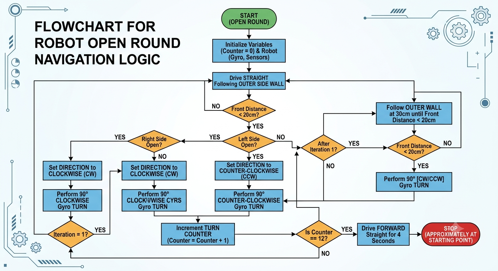

#### Obstacle Round Diagrams
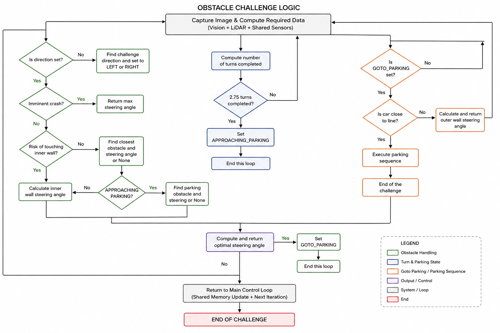

##### Others 
**Corner Logic Open Round**
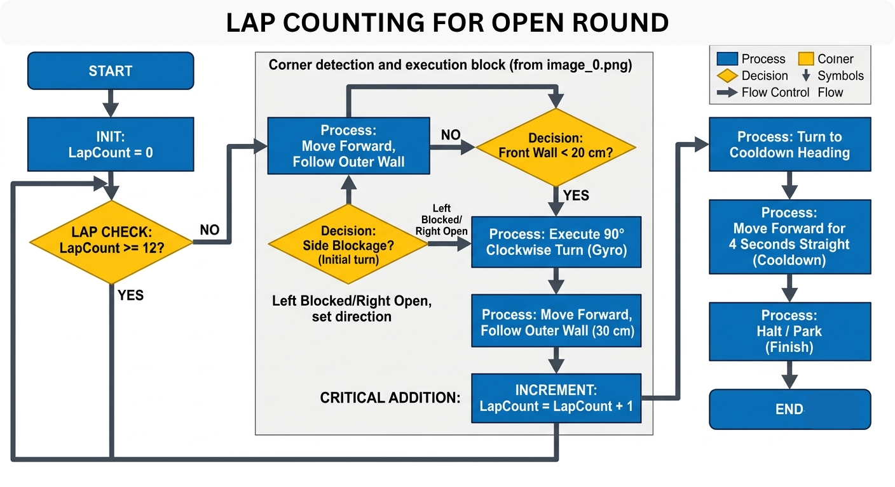

