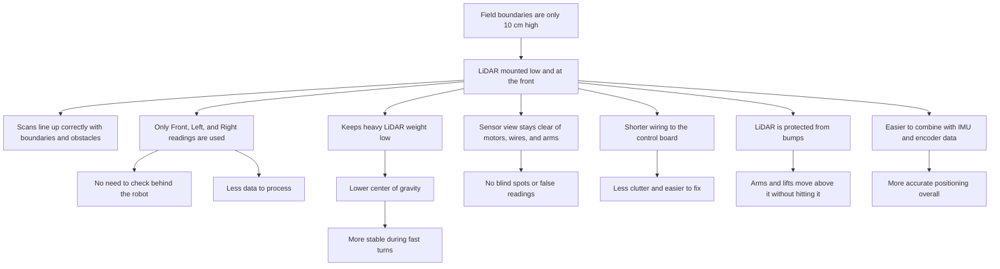

# Mechanical Design Approach 

## 1. Basic Mechanical Choices

##### 1.1 Wheel Choice 
We chose the 43mm N20-compatible rubber wheels because they provide a good balance between grip, stability, manoeuvrability and size. The rubber tyre gives the robot good traction on the surface, reducing slipping and allowing more consistent movement and turning. The 43mm diameter is large enough to provide adequate ground clearance and smooth movement, while still being compact enough to fit within our robot’s design without taking up excessive space. Their 18mm width provides sufficient contact with the surface for stability without adding unnecessary weight. At only 18g per wheel, they help keep the robot lightweight, while their 3kg loading capacity provides more than enough support for our robot. The wheels are also directly compatible with N20 gear motors and have a 3mm shaft hole, simplifying the mechanical assembly. Additionally, the 12-pulse-per-revolution encoder provides accurate wheel rotation feedback, which can help with precise movement and distance control.

##### 1.2 Steering System 
- Prototype:
- Servo: 

##### 1.3 Differential Gear (Rear Wheels)
We chose an RC car rear differential gear to efficiently transfer power from the motor to both rear wheels while allowing the wheels to rotate at different speeds during turns. This is important because the outer wheel travels a greater distance than the inner wheel when the robot turns. The differential therefore reduces wheel slipping and friction, allowing smoother and more controlled turns.

In our design, we changed the orientation of the differential gear to improve its efficiency and integration with the rest of the drivetrain. We also increased the distance between the LiDAR stand and the differential gear compared to last year’s design. Previously, the smaller spacing caused the differential assembly to come too close to the LiDAR stand, creating a risk of interference or collision. Increasing this clearance gives the LiDAR more space and prevents mechanical components from obstructing its operation.

This modification also makes the overall drivetrain more reliable by reducing unnecessary contact between components and providing better separation between the sensing and drive systems. The differential gear therefore contributes to both the robot’s turning performance and the improved mechanical layout of the final design.

##### 1.4 Dimension Choices 
**Dimensions:** **50 cm × 29.5 cm × 22 cm**  
**Length × Width × Height**

**Why We Chose These Dimensions:**

We chose the dimensions of **50 cm × 29.5 cm × 22 cm** to provide a balance between **stability, manoeuvrability, and component placement**. The 50 cm length provides enough space to accommodate the drivetrain, battery, electronics, and sensors while maintaining a compact overall design. The 29.5 cm width provides sufficient stability during movement and turning without making the robot unnecessarily wide. The 22 cm height keeps the robot's centre of mass relatively low while providing enough clearance for mounting the camera, LiDAR, and other electronic components. These dimensions also allow the robot to remain compact enough for efficient navigation around the track.

#### 1.5 Lidar position reasoning
Here's the detailed version rewritten in simpler language:

---

**Why We Placed the LiDAR at the Bottom Front of the Robot**

We decided to mount the LiDAR sensor as low as possible on the robot, and at the front, instead of putting it higher up or in the middle. Here's why we made that choice:

1. **The Boundaries Are Only 10 cm High**
The walls around the competition field are just 10 cm tall. If we mounted the LiDAR any higher than that, its scanning beam would pass over the top of the boundaries instead of hitting them. That would mean the robot couldn't "see" the walls at all, or it would only catch them at a weird angle that gives unreliable readings. By keeping the LiDAR low, close to the height of the boundaries, we make sure the sensor always detects them properly.

2. **We Only Use the Front, Left, and Right Readings**
Since the LiDAR is mounted at the front of the robot, we only look at the distance readings coming from three directions: straight ahead, to the left, and to the right. We don't use the readings from behind the robot, because that direction would just be pointing back into the robot's own body, not out into the field. This also means the robot doesn't have to process a full circle of data — just the three directions it actually needs to make driving decisions.

3. **It Keeps the Robot's Weight Low**
The LiDAR and the bracket that holds it are some of the heavier parts on the robot. By mounting them near the bottom, we keep the robot's center of gravity low. This makes the robot more stable when it's turning quickly, speeding up, or slowing down, so it's less likely to tip over during sharp movements.

4. **It Avoids Getting Blocked by the Robot's Own Parts**
If the LiDAR were mounted higher up, other parts of the robot — like motors, wires, or arms — could get in the way of its scanning beam. This would create blind spots or cause the sensor to pick up false readings from bouncing off the robot's own body. Mounting it low and at the front keeps its view clear.

5. **It Shortens the Wiring**
Since the LiDAR is near the bottom, close to where the main control board usually sits, the wires connecting them don't have to travel far. This means less clutter, less chance of signal problems, and it's easier to fix things if something goes wrong.

6. **It Protects the LiDAR from Getting Bumped**
Mounting the LiDAR low and tucked in helps protect its spinning parts from accidentally getting hit by other moving parts of the robot, like an arm or lift, which are usually mounted higher up and move around during a run.

7. **It Makes Combining Sensor Data Easier**
Our robot doesn't rely on the LiDAR alone — it also uses data from wheel encoders and an IMU (a sensor that tracks movement and orientation) to figure out where it is. When the LiDAR is mounted low and facing forward, it's easier to combine all this data together accurately, because everything is aligned in a similar reference point close to the ground.

---

